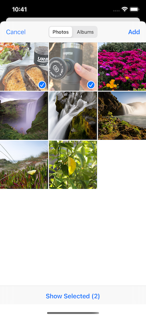

# SORAPhotoPicker

A PHPickerViewController wrapper for SwiftUI project.



## Requirements
- iOS 14.0 +


## How to use
```swift
//
// 1. Open photo picker
//
#import SORAPhotoPicker 

SORAPhotoPickerHelper.shared.picker() { results in
  
}
```


```swift
//
// 2. Selection result: array of SORAPhotoPickerResult
//
@State private var selected: [SORAPhotoPickerResult] = []

SORAPhotoPickerHelper.shared.picker() { results in
  self.selected.append(contentsOf: results)
}
```

```swift
//
// 3. Load image
//
@State private var image: UIImage? 
...
result.loadUIImage { image, error in
    guard let image = image, error == nil else {return}
    self.image = image
    ...
}

//
// 4. Load video
//
@State private var videoURL: URL?
...
result.loadVideo { videoURL, error in
    guard let url = videoURL, error == nil else {return}
    self.videoURL = url
}
```

```swift
//
// 5. Display image 
//
var body: some View {
   Image(uiImage: self.image!)
        .resizable()
        .aspectRatio(contentMode: .fit)
        .frame(width: 300) 
}

//
// 6. Display video
//
var body: some View {
   VideoPlayer(player: AVPlayer(url: videoURL!))
      .frame(width: 300)
}
```
